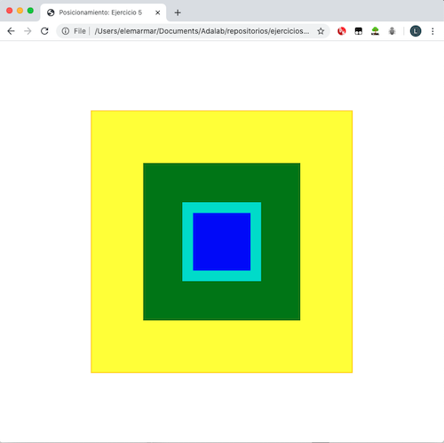
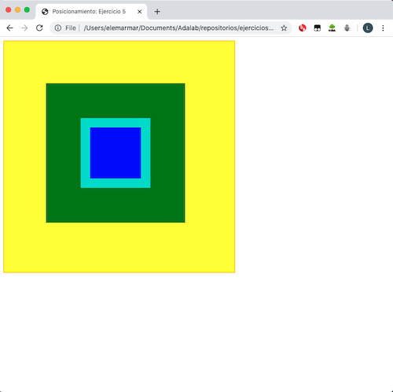

# Cajas sobre cajas

Este problema puede tener numerosas soluciones. Aquí presento dos versiones:


### Opción 1: Todo centrado en la pantalla

Todas las cajas aparecen centradas en el medio de la ventana del navegador. Su posición es absoluta, con lo que están posicionadas relativas a la ventana del navegador. 



---

### Opción 2: Cajas verde y azul centradas sobre la amarilla en su posición original



👉🏻 Creo que esta es la que se pedía en el enunciado.

---

**Nota**

Esta opción se puede realizar de diferentes maneras. Yo he optado por escribir menos código y por eso, después de definir las cajas (tamaño, color) he utilizado el selector `div:not(.yellow)` para posicionar las cajas verde y azul en el centro de la amarilla. Esto también se podría haber conseguido con algo así:

```css
.green {
  height: 300px;
  width: 300px;
  background-color: green;
  padding: 75px;
  /* Añade posicionamiento */
  position: absolute;
  left: 250px;
  top: 250px;
  transform: translate(-50%, -50%);
}

.blue {
  height: 150px;
  width: 150px;
  background-color: blue;
  border: solid 20px turquoise;
  /* Añade posicionamiento */
  position: absolute;
  left: 250px;
  top: 250px;
  transform: translate(-50%, -50%);
}
```

Otra variante:

```css
/* Una vez definido las cajas: */
.blue, .green {
  position: absolute;
  left: 250px;
  top: 250px;
  transform: translate(-50%, -50%);
}
```

—🦊 [Elena *mm*](https://github.com/elemarmar) 