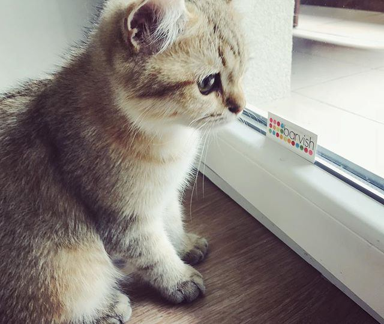

# Bootstrap página de gatitos


Para realizar este ejercicio he utilizado Bootstrap. Para utilizar el sistema de grid de Bootstrap tenemos que utilizar:

1. un contenedor: `container`, `container-fluid`
2. filas: `row`
3. y columnas: `col`


> **Evitar gutters**  Para evitar espacios entre las columnas utilizo `no-gutters` en las dos `row` que he creado.
>
> Ejemplo:
>
> ```html
> <div class="row header no-gutters">
> 	...
> </div>
> ```

---

## Sección header

Como la sección header sólo tiene una columna con los textos, no tenemos por qué definir el tamaño de la columna y con un simple `col` ocuparía el total de la fila:

```html
<div class="row header no-gutters">
	<div class="col">
		<div class="heading">
			<h1>Bla bla bla</h1>
			<p> Blo blo blu blu</p>
		</div>
	</div>
</div>
```

---

## Sección gatitos

La sección gatitos tiene más mañana. Queremos lo siguiente:

1. Que en versión **large** todas las imágenes aparezcan en la misma fila. Si una fila de Bootstrap tiene 12 columnas, haciendo una división sencillita, nos sale a que cada una tiene que ocupar **3** columnas, lo que se traduce en sintaxis de Bootstrap a: `col-lg-3`
2. Que en versión **medium** aparezcan dos imágenes por fila. Siguiendo la misma lógica necesitaría cada una ocupar **6** columnas en medium, lo que se traduce en: `col-md-6`
3. De la versión móvil no nos preocupamos, porque una vez que definimos el nº de columnas a ocupar en una determinada sección (ej. `md`, `lg`) , siempre que la pantalla se haga más pequeña que esa sección (ej. `sm`), **si no hemos definimos cuántas columnas** queremos para esa sección más pequeña, cada celda ocupará todas las columnas.

---

Con esta información la sección de gatitos nos quedaría así:

```html
<div class="row no-gutters">
	<div class="col-md-6 col-lg-3 img-container">
		
	</div>
	<div class="col-md-6 col-lg-3 img-container">
		
	</div>
	<div class="col-md-6 col-lg-3 img-container">
		
	</div>
	<div class="col-md-6 col-lg-3 img-container">
		
	</div>
</div>
```

> Aquí hemos definido que cada celda de gatitos ocupe en modo large 3 columnas (`col-lg-3`) de modo que todas las imágenes aparezcan en una fila.
>
> Si no definimos nada más,  cuando la pantalla fuera más pequeña que large, las imágenes nos aparecerían una debajo de otra. Para evitar eso, definimos `col-md-6` de modo que cuando la pantalla sea menor que large y por lo menos medium, cada imagen ocupe 6 columnas (la mitad del total).
>
> No hace falta que definamos `col-sm-12` porque el comportamiento por defecto de Bootstrap es que cuando no defines el nº de columnas a ocupar en un tamaño -> si es menor que uno ya definido, ocupará el total de columnas.

