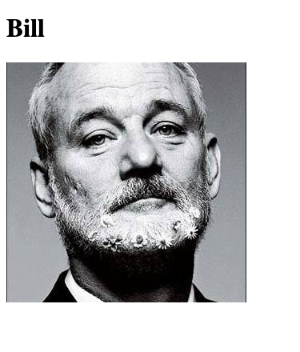
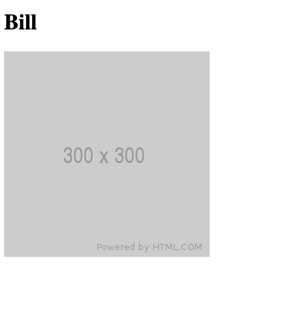

# Nadie sin avatar

Partimos de este código de js:

```js
'use strict';

// avatar por defecto
const DEFAULT_AVATAR = 'http://placehold.it/300x300';
// avatar que eligió el usuario al registrarse
let userAvatar = 'http://www.fillmurray.com/300/300';
```

Y nos piden:

## 1. Añadir imagen de userAvatar a la etiqueta de img

1. Añado en el html el atributo `src=""` y lo dejo vacío. Esto lo hago para poder luego asignarle un valor a este atributo que será igual al valor de la variable `userAvatar`

2. En el `main.js` voy a crear una constante que haga referencia a la etiqueta ``:

   ```js
   const avatarImg = document.querySelector('.user__avatar');
   ```

3. Para cambiar la imagen necesitamos cambiar el valor del atributo de `src`. Par hacer esto utilizamos el `setAttribute` que nos permite elegir un atributo y darle un valor:

   ```js
   avatarImg.setAttribute("src", userAvatar);
   ```

   > 👉🏻 De esta manera, al `avatarImg` (que es nuestra etiqueta imagen) le asignamos al atributo de `src` el valor de la variable `userAvatar` que es la foto de Bill.

Resultado:



---

## 2 & 3. Mostrar una imagen de usuario sí o sí teniendo la variable `userAvatar` vacía desde el principio

Partiendo de la siguiente base en js:

```js
'use strict';

// avatar por defecto
const DEFAULT_AVATAR = 'http://placehold.it/300x300';
// avatar que eligió el usuario al registrarse
let userAvatar = '';
```

1. Seguimos utilizando la constante que creamos para hacer referencia a la etiqueta de imagen

   ```js
   const avatarImg = document.querySelector('.user__avatar');
   ```

2. Utilizamos la misma fórmula de antes con el `setAttribute` para escoger la fuente de la imagen que se mostrará pero tenemos que cambiar el valor:

   ```js
   avatarImg.setAttribute("src", userAvatar || DEFAULT_AVATAR);
   ```

   > 👉🏻 Aquí lo que le estamos diciendo con el operador lógico de OR es que "Utiliza el valor guardado en la variable `userAvatar` pero si es `falsy` (si es null, undefined, NaN o está vacío, que es el caso), entonces utiliza el valor de la constante `DEFAULT_AVATAR` que sí que tiene link a una imagen"

Resultado:



—🦊 [Elena *mm*](https://github.com/elemarmar) 