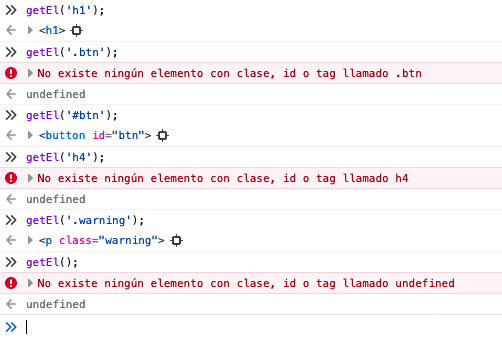

Aquí están integrados los ejercicios 5 y 6 de la lección 4. Para este ejercicio teníamos que crear una función que acepta un parámetro (llamado selector) y devuelve el elemento del html que tiene ese parámetro como selector.

Además, al incorporar el ejercicio 6 he creado un **if statement** que nos devuelve el elemento si el parámetro que le pasemos a la función existe O nos devuelve un mensaje de error si no existe. Esta condicional la he construido así:

```js
    // Si element existe, es truthy, return su valor   
		if (element) {
        return element;

    // si element es false, mandar error
    } else {
        console.error(`No existe ningún elemento con clase, id o tag llamado ${selector}`)
    }
```


Resultados en la condicional:



—🦊 [Elena *mm*](https://github.com/elemarmar) 