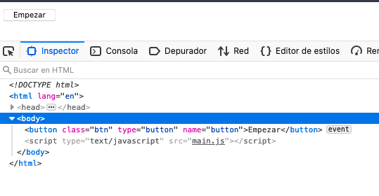
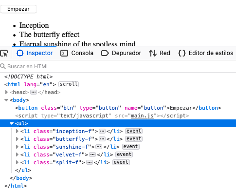
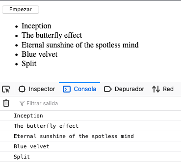

# ¿Qué vemos esta noche?

Este ejercicio tiene dos partes:

---

## Parte 1: Pintar películas:

Para pintar las pelis tenemos que elegir el método. Yo lo he hecho con `body.innerHTML` pero hay que tener cuidado porque al hacer esto con un `=` estaríamos sustituyendo TOOOODO el contenido de dentro del html del elemento body con las pelis. Así que me he decantado por utilizar el operador `+=` que básicamente dice "A todo lo que ya tenía, añádele esto". Se ve así:

```js
document.querySelector("body").innerHTML += `<ul>
	<li class="inception-f">${inception}</li>
	<li class="butterfly-f">${theButterFlyEffect}		</li>
	<li class="sunshine-f">${eternalSunshineOfTheSM}</li>
	<li class="velvet-f">${blueVelvet}</li>
	<li class="split-f">${split}</li>                                       </ul>`
```

> De esta manera el botón que teníamos en el HTML no se elimina! simplemente después de ese botón se añade el listado. 👍🏻

---

## Parte 2: Console.log el nombre de la peli

Esta parte tiene algo más de maña. Nos piden que hagamos console.log con el nombre de la peli sobre la que hagamos click. Para hacer esto es importante tener una cosa clara: **Las películas NO existen en el HTML hasta que no pulsamos el botón**

Aquí lo vemos bien:

Antes de pulsar el botón:



Después de pulsar el botón:



Debido a esto NO podemos crear constantes haciendo referencia a estas películas antes de que el botón se clickee, por lo que habría que declararlas DENTRO de la función que pinta las pelis en el HTML. De lo contrario, el valor de dichas constantes seria de NULL.

> **Nota**
>
> Yo he decidido utilizar variables para declararlas al principio del documento y asignarles el valor DENTRO de la función `printMovies()` una vez que se crean las pelis.

```js
/* al principio */
let inceptionEl;
let butterflyEl;
let sunshineEl;
let velvetEl;
let splitEl;

/* DENTRO de función */
inceptionEl = document.querySelector(".inception-f");
butterflyEl = document.querySelector(".butterfly-f");
sunshineEl = document.querySelector(".sunshine-f");
velvetEl = document.querySelector(".velvet-f");
splitEl = document.querySelector(".split-f");
```

Siguiendo esta misma lógica, no podemos añadir el eventListener a las pelis si estas NO existen, por lo que habría que hacerlo cuando ya estén cargadas y hayamos creado las variables que hacen referencia a ellas:

```js
inceptionEl = document.querySelector(".inception-f");
butterflyEl = document.querySelector(".butterfly-f");
sunshineEl = document.querySelector(".sunshine-f");
velvetEl = document.querySelector(".velvet-f");
splitEl = document.querySelector(".split-f");
    
    // Les añadimos los eventListeners que ejecutan la función de movieClickHandler cuando hacemos click sobre las pelis:
inceptionEl.addEventListener('click', movieClickHandler);
butterflyEl.addEventListener('click', movieClickHandler);
sunshineEl.addEventListener('click', movieClickHandler);
velvetEl.addEventListener('click', movieClickHandler);
splitEl.addEventListener('click', movieClickHandler);
```


Resultado: 

---

Echarle un ojo y si tenéis alguna duda o problema, ¡mandadme un mensaje! 👋🏻

—🦊 [Elena *mm*](https://github.com/elemarmar) 