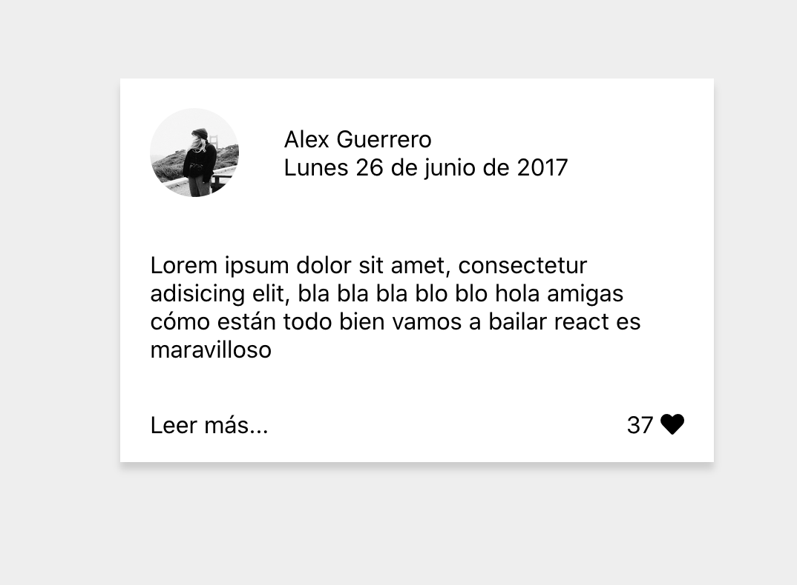

# README

1. Creamos un nuevo proyecto de React llamado mediacard: para ello nos vamos a la carpeta de nuestro ordenador que queramos y corremos en la terminal:

   ```bash
   create-react-app mediacard
   ```

2. Creamos los elementos que componen la tarjeta utilizando **JSX** (sintaxis muy parecida a HTML)

   ```react
   
   const picURL = 'https://images.unsplash.com/photo-1595119396388-b8822b6c91fc?ixlib=rb-1.2.1&ixid=eyJhcHBfaWQiOjEyMDd9&auto=format&fit=crop&w=1350&q=80';
   
   function App() {
     return (
       <div className="App">
         <div className="card">
           <div className="card__profile">
             
             <div className="card__profile-text">
               <p className="card__profile-name">
                 Alex Guerrero
               </p>
               <p className="card__profile-date">
                 Lunes 26 de junio de 2017
               </p>
             </div>
           </div>
           <div className="card__text-content">
             <p>Lorem ipsum dolor sit amet, consectetur adisicing elit, bla bla bla blo blo hola amigas cómo están todo bien vamos a bailar react es maravilloso</p>
           </div>
           <div className="card__extra">
             <p className="read-more">Leer más...</p>
             <p className="favorite">37 <i className="fas fa-heart"></i></p>
           </div>
         </div>
       </div>
     );
   }
   ```

   > 👉🏻 La url de la imagen la he metido en una constante y luego he accedido a ella dentro de la sintaxis JSX con `{picURL}`

   > He utilizado una función (venía por defecto), pero esto se podría hacer con clase:
   >
   > ```react
   > class App extends React.Component {
   >   // contenido
   > }
   > ```

3. Le aplicamos los estilos.

4. No olvidemos importar los estilos! (ya viene por defecto en `App.js`)

   ```react
   import React from 'react';
   import './App.css';
   ```




---

## 👉🏻 Notas:

- no olvides añadir la librería de **fontawesome** si la vas a utilizar. Esto se hace en el html

  ```html
      <!-- Font Awesome -->
      <script
        src="https://kit.fontawesome.com/24e900d194.js"
        crossorigin="anonymous"
      ></script>
  ```


—🦊 [EMM](https://github.com/elemarmar)

