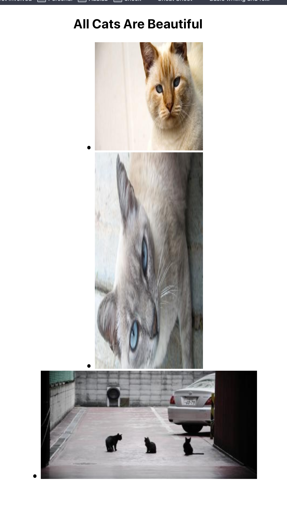

# README

## Nota

👉🏻 Para poner un valor por defecto a los props he utilizado el operador lógico `OR`: `||`, de manera que si no se da un valor de width o de height, el valor de este sería lo que he puesto a la derecha del `||`. **En el [tema siguiente](https://books.adalab.es/materiales-front-end-j/modulo-3/3_4_componentes_react#valores-por-defecto-de-las-props) nos enseñan una manera de crear valores por defecto para las `props` !!** 

```JSX
class RandomCat extends React.Component {
    render() {
        const randomCat = getRandomInteger(NUMBER_OF_CATS);
        
        return(
            <a href="http://lorempixel.com">
                            
            </a>
        );
    }
}
```


**CatList.js**

```JSX
class CatList extends React.Component {
    render() {
        return(
            <section className="section-cats">
            <h1>All Cats Are Beautiful</h1>
            <ul className="section-cats_list">
              <li>
                <RandomCat width="200px" height="200px"/>
              </li>
              <li>
                <RandomCat width="200px" height="400px"/>
              </li>
              <li>
                <RandomCat />
              </li>
            </ul>
          </section>
        );
    }

}
```

**Result**: (pasándole las medidas del ejercicio, si bien al último no se le pasan width y height, por lo que toma los valores por defecto que describí arriba con:)

```JSX
width={this.props.width || '400px'} //!!
height={this.props.height || '200px'} //!!
```





—🦊 [EMM](https://github.com/elemarmar)