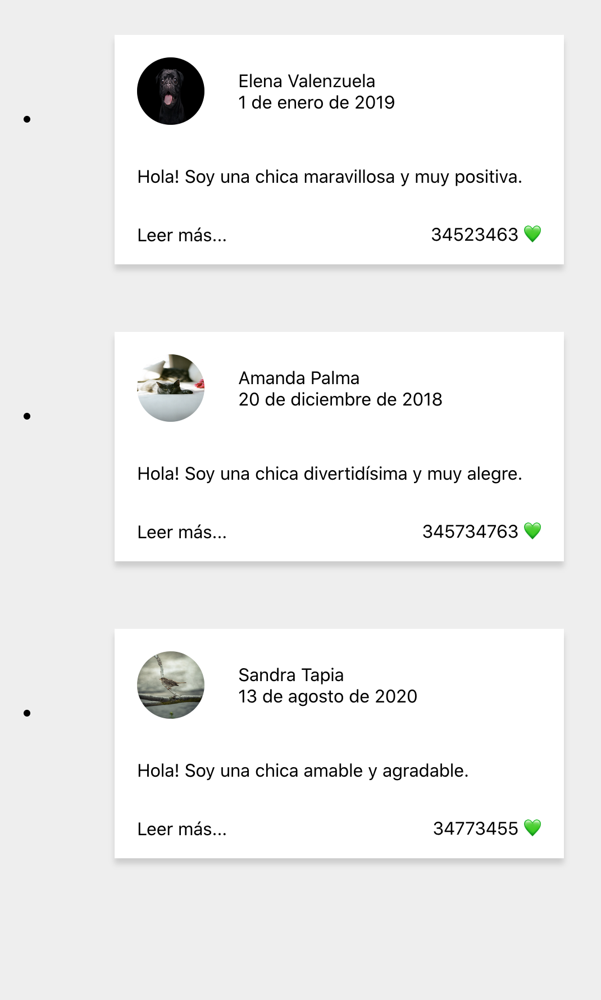

# README

> He metido los links de diferentes imágenes en constantes para dejar el código dentro del componente más limpio.

```JSX
const pic1URL = 'https://images.unsplash.com/photo-1595114720921-5a56692ed4ae?ixlib=rb-1.2.1&ixid=eyJhcHBfaWQiOjEyMDd9&auto=format&fit=crop&w=700&q=60';
const pic2URL = 'https://images.unsplash.com/photo-1595089911462-6d66664ca5c0?ixlib=rb-1.2.1&ixid=eyJhcHBfaWQiOjEyMDd9&auto=format&fit=crop&w=700&q=60';
const pic3URL = 'https://images.unsplash.com/photo-1595111714200-0d597e920388?ixlib=rb-1.2.1&ixid=eyJhcHBfaWQiOjEyMDd9&auto=format&fit=crop&w=700&q=60';


/* Componente de clase */
class MediaList extends React.Component {
	render() {
		return (
      <ul>
        <li>
          <MediaCard 
            name="Elena Valenzuela"
            date="1 de enero de 2019"
            img={pic1URL}
            text="Hola! Soy una chica maravillosa y muy positiva."
            likes="34523463"
            heart="💚"
            />
        </li>
        <li>
          <MediaCard 
            name="Amanda Palma"
            date="20 de diciembre de 2018"
            img={pic2URL}
            text="Hola! Soy una chica divertidísima y muy alegre."
            likes="345734763"
            heart="💚"
            />
        </li>
        <li>
          <MediaCard 
            name="Sandra Tapia"
            date="13 de agosto de 2020"
            img={pic3URL}
            text="Hola! Soy una chica amable y agradable."
            likes="34773455"
            heart="💚"
            />
        </li>
      </ul>
    )
  }
}
```

**Versión funcional de este componente** (en lugar de utilizar `class`):

> ⚠️ No utilizamos `render()` en componentes funcionales!

```JSX
const MediaList = () => {
  return (
    <ul>
      <li>
        <MediaCard 
          name="Elena Valenzuela"
          date="1 de enero de 2019"
          img={pic1URL}
          text="Hola! Soy una chica maravillosa y muy positiva."
          likes="34523463"
          heart="💚"
          />
      </li>
      <li>
        <MediaCard 
          name="Amanda Palma"
          date="20 de diciembre de 2018"
          img={pic2URL}
          text="Hola! Soy una chica divertidísima y muy alegre."
          likes="345734763"
          heart="💚"
          />
      </li>
      <li>
        <MediaCard 
          name="Sandra Tapia"
          date="13 de agosto de 2020"
          img={pic3URL}
          text="Hola! Soy una chica amable y agradable."
          likes="34773455"
          heart="💚"
          />
      </li>
    </ul>
  )
}
```

---

## Nota

Como siempre, he creado carpeta **components** y he metido ahí todos los componentes, incluído `App`, por lo que he necesitado cambiar las direcciones relativas:

**index.js**

```JSX
import App from './components/App';
```

**App.js**

```JSX
import '../App.css';
```

**Resultado**



> 👉🏻 **Nota importante:** Aunque ponga "amable y agradable" en verdad Sandra es **súper** amable y **súper extra mega** agradable.

—🦊 [EMM](https://github.com/elemarmar)

