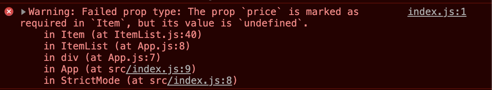
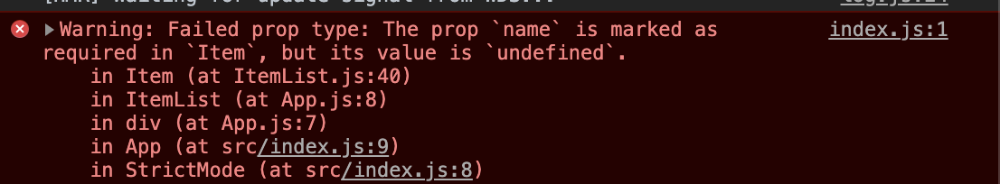

# README

Parte interesante del código:

**Item.js**:

```react
import React from 'react';
// NO olvides importar Prop-types e INSTALARLO!
import PropTypes from 'prop-types';

class Item extends React.Component {
  render() {
    return (
      // (mira el código de Item.js)
    );
  }
}


/*Establecemos valor de las props por defecto con `defaultProps`*/
Item.defaultProps = {
  description: 'No hay descripción.'
}

/* Hacer el nombre y precio obligatorio y que el precio sea de tipo numérico */
// --> usamos `propTypes`
Item.propTypes = {
  name: PropTypes.any.isRequired,
  price: PropTypes.number.isRequired
}


export default Item;

```

>No nos pone qué tipo de valor  name tiene que ser, así que le pongo `any` (aunque realmente sería un `string`)


Tipos de errores que podemos ver en consola si no ponemos un nombre o precio:





—🦊 [EMM](https://github.com/elemarmar)

