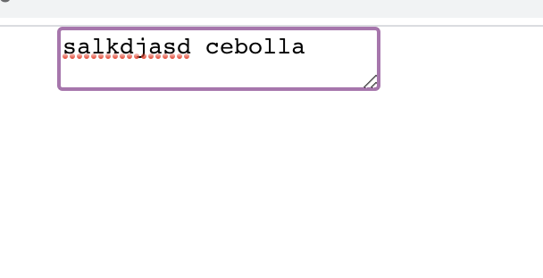
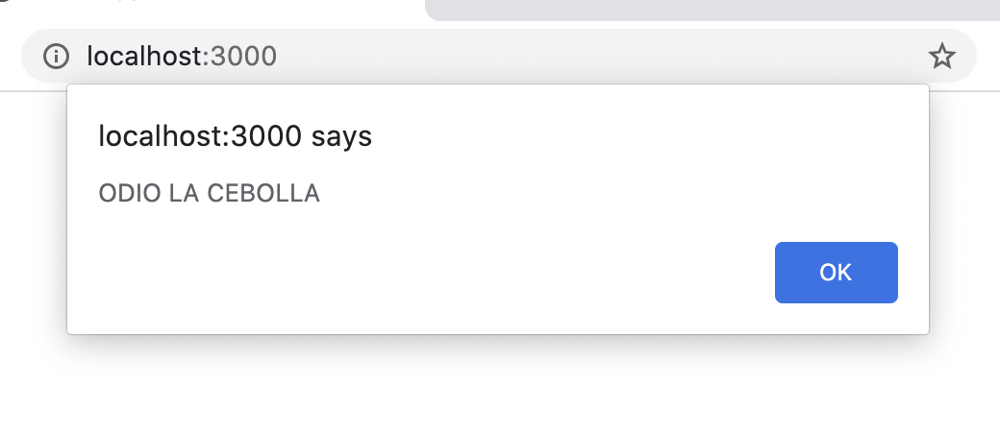

# README





**OnionHater.js**

```jsx
const textareaHandler = ev => {
  const value = ev.target.value;
  if (value.includes('cebolla')) {
    alert('ODIO LA CEBOLLA');
  }
}

class OnionHater extends React.Component {

  render() {
    return (
      <textarea onChange={textareaHandler}></textarea>
    )
  }
}
```

