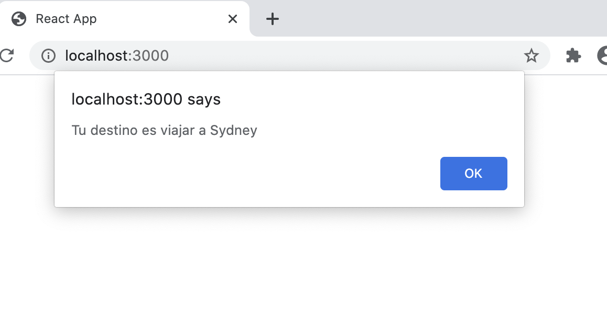
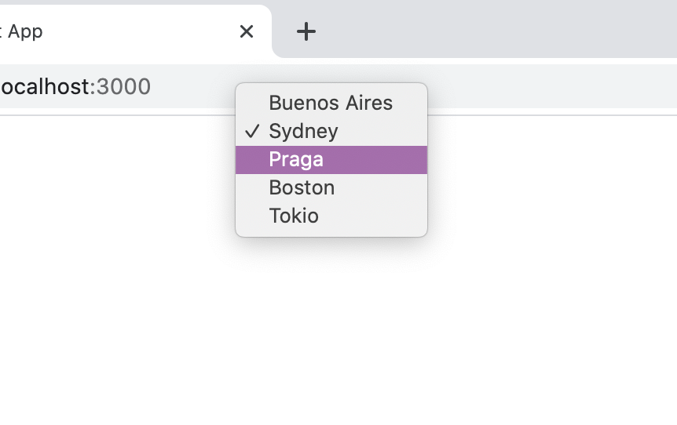

**Destiny.js**

```jsx
const destinyHandler = ev => {
  alert(`Tu destino es viajar a ${ev.target.value}`)
}

class Destiny extends React.Component {

  render() {
    return (
      <select name="destinies" onChange={destinyHandler}>
        <option value="Buenos Aires">Buenos Aires</option>
        <option value="Sydney">Sydney</option>
        <option value="Praga">Praga</option>
        <option value="Boston">Boston</option>
        <option value="Tokio">Tokio</option>
      </select>
    )
  }
}
```





