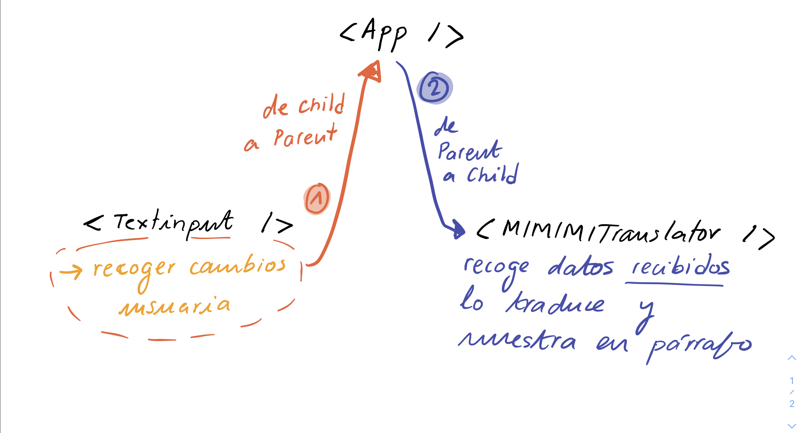
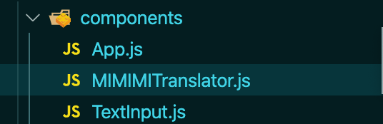

# README

## Importante

Chicas, antes de poneros como locas a hacer ejercicios y daros cabezazos contra la pared os recomiendo haceros una chuleta propia tipo esquema en la que venga cómo pasar información entre componentes. Así, si en un ejercicio tenéis que pasar información de un componente a otro podéis mirarla y no desesperar. Además ayuda a entenderlo mejor. 

Estos ejemplos de aquí los he sacado de este [post de medium](https://medium.com/@nipunadilhara/passing-data-between-different-components-using-react-c8e27319ee69) (inglés). No os rayéis por cómo declara los métodos y tal (que no los declara primero en el constructor, como lo estamos haciendo en Adalab). Quedaros sólo con la lógica de interacción entre componentes.

Imaginemos que tenemos esta estructura de componentes:

```
/src
|__ /components
|   |__ Parent.js
|   |__ Child1.js
|   |__ Child2.js
|
|__ App.js 
```

Ahora vamos a ver cómo pasar información de parent a child, de child a parent y de child a child (entre sibilngs)

---

## De Parent a Child (el más fácil) 

Este se hace utilizando los `props` que ya conocemos. 

1. En el Componente padre le pasamos los valores (del PADRE) al componente HIJO.

   **Parent.js**

   ```jsx
   import React from 'react';
   import Child1 from './Child1';
   
   class Parent extends React.Component{
     value="Value From Parent";
   	render(){
     	return(
       	<div>
         	<Child1 valueFromParent={this.value}/> // esto
       	</div>
     );
   }
   }export default Parent;
   ```

   > El valor de `value` lo cogemos de dentro del componente de clase PADRE. Puede ser, por ejemplo, el value de un input que hemos metido en una constante (dentro del padre) y queremos pasársela al hijo. En este caso es el texto "Value From Parent"
   >
   > O puede ser una constante que hemos llamado `isLove` y que tiene un valor de `true` que queremos pasarle al hijo. En este caso:
   >
   > ```jsx
   > <Child1 valueFromParent={this.isLove}/>
   > ```

2. Para acceder al valor que le pasamos del padre desde el componente HIJO utilizamos los `props`

   ```jsx
   import React, {Component} from 'react';
   class Child1 extends Component{
     render(){
       return(
         <div>
           <h2>{this.props.valueFromParent}</h2>
         </div>
       );
     }
   }
   export default Child1;
   ```

   > El `valueFromParent` es un nombre que elegimos en el componente PADRE ` <Child1 valueFromParent={this.value}/>` pero que podríamos haber llamado como quisiéramos. 

> Básicamente estamos diciendo algo como: 
>
> ```jsx
> <Child1 valueFromParent={this.value}/>
> ```
>
> "El el componente `Child1`, crea un "atributo HTML" que se llame `valueFromParent` que va a tener el valor de `value` (`value` es del padre).
>
> Entonces luego vamos a nuestro componente hijo `Child1` y escribimos:
>
> ```jsx
> <h2>{this.props.valueFromParent}</h2>
> ```
>
> Diciéndole al elemento `<h2>` del HIJO `Child1`: "Oye, en vez de tener un texto fijo que yo escriba aquí a mano, el texto que vas a mostrar va a ser el valor que se le haya asignado "al atributo de HTML" que hemos creado llamado `valueFromParent`, que en este caso desde el PADRE le hemos dado el valor que tenga `value`." 

---

## De Child a Parent

Esto es más complicado. Si no queremos utilizar `states` que todavía no los hemos dado (próxima lección 😅) entonces lo hacemos de la siguiente manera:

1. Creamos una función en el PADRE que va a recoger los datos que queramos mandar desde el HIJO.

2. Pasamos esta función que hemos creado en el PADRE al hijo utilizando.... ¡los `props`! 

   > Ejemplo: En el PADRE creamos una función que se llama `parentFunction` y se la vamos a pasar por `props` al hijo tal que así (no os rayéis por los this, bind, etc, este ejemplo lo he cogido del post de arriba y la sintaxis que utiliza camabia un poco):
   >
   > ```jsx
   > <Child1 functionCallFromParent={this.parentFunction.bind(this)}/>
   > ```
   >
   > 👉🏻 Hemos creado un atributo de HTML para el HIJO Child1 que se llama `functionCallFromParent` y el valor que le pasamos para que lo recoja el hijo es la función `parentFunction` (¿muchos `this`? SI, LO SÉ 😫 los componentes de clase...).

3. Llamamos a la función `parentFunction` desde el HIJO Child1 (porque ya tenemos acceso a ella a través del atributo "`functionCallFromParent`" que hemos creado) para pasarle información. ¿Y cómo pasamos información a una función? 🎉 PARÁMETROS 🎉

   **Parent.js**

   ```jsx
   import React, {Component} from 'react';
   import Child1 from './Child1';
   class Parent extends Component{    
     /* LA función del padre que vamos a pasar al hijo para OBTENER por PARAMETRO información DEL HIJO */
     parentFunction=(data_from_child)=>{
       console.log(data_from_child);
     }
   
     render(){
       return(
         <div>      
           <Child1 functionCallFromParent={this.parentFunction.bind(this)}/>
         </div>
       );
     }
   }
   export default Parent;
   ```

   

   **Child1.js**

   ```jsx
   import React, {Component} from 'react';
   
   class Child1 extends Component { 
     childFunction=(e)=>{
       e.preventDefault();
       this.props.functionCallFromParent("Hello From Child1");
     }    
     render(){
       return(
         <div>   
           <button onClick={this.childFunction.bind(this)}>Click</button>
         </div>
       );
     }
   }
   export default Child1;
   ```

   > Aquí podemos ver que:
   >
   > 1. Tenemos un Componente de **clase** llamado **Child1**
   >
   > 2. Como es de clase, cuando utilicemos el `props` necesitamos ponerlo `this.props` 👉🏻 Se crea una función dentro del Componente llamada `ChildFunction` que dentro le pasa como argumento al `this.props.functionCallFromParent` ---> (que es la función del padre `parentFunction`) un parámetro `"Hello From Child1"`. 👇🏼
   >
   >    ```jsx
   >    <Child1 functionCallFromParent={this.parentFunction.bind(this)}/>
   >    ```

   Echadle un ojo a los dos documentos **Parent.js** y **Child1.js** e intentad descubrir qué hace este programita. 

   > cuando se hace clic en el botón de Child1, se dispara la 'parentFunction' en Parent y se registran los datos pasados como argumento desde el hijo, en este caso:  "Hello From Child1".

/!\ Los datos que le pasamos al padre sólo se podrían utilizar DENTRO de esa función. Si quisiéramos utilizarlos fueras necesitaríamos los `state` que vemos mañana. Así que relax.

---

Vamos con el ejercicio:

He hecho este esquema para saber cómo se conectan los componentes y qué tareas tienen. Así, es más fácil saber cómo tenemos que enviar la información entre componentes (porque depende de si son parent o child):



1. Primero vamos a crear los tres componentes. **App.js** será el padre, que tendrá dos hijos **TextInput.js** y **MIMIMITranslator.js**

   

2. Ahora vamos a rellenar el **App.js** (Parent):

   ```jsx
   import React from 'react';
   import TextInput from './TextInput';
   import MIMIMITranslator from './MIMIMITranslator';
   import '../App.css';
   
   
   class App extends React.Component {
   
     render() {
       return (
         <div className="App">
           <TextInput />
           <MIMIMITranslator />
         </div>
       );
     }
   }
   
   export default App;
   ```

3. Ahora ya empezamos con la chicha. Vamos a seguir nuestro esquemita. Empezamos con **TextInput.js** que tiene que (1) recoger datos introducidos en el `textarea` y (2) mandarlos al parent **App.js** 

   ```jsx
   import React from 'react';
   
   class TextInput extends React.Component {
     render() {
       return(
         <form>
           <textarea></textarea>
         </form>
       )
     }
   }
   
   export default TextInput;
   ```

   Pasar de hijos a padres es más chunguito que de padre a hijo así que cogemos el esquema propio que nos hicimos para hacer estas cosas...

   1. (esquema paso 1) Creamos una función en el PADRE que va a recoger los datos que queramos mandard esde el HIJO.

      **App.js**

      ```jsx
      class App extends React.Component {
        constructor(props) {
          super(props);
          this.myText = '';
          this.translateText = this.translateText.bind(this);
        }
      
        translateText(text_from_child) {
          this.myText =  text_from_child.replace(/[aeiou]/ig, 'i');
          this.forceUpdate();
        }
      
        render() {
          return (
            <div className="App">
              <TextInput getInformation={this.translateText(this)}/>
              <MIMIMITranslator />
            </div>
          );
        }
      
      }
      
      export default App;
      
      ```

      > Aquí he creado la función en el padre que se llama `translateText`. ¿Muchos THIS? SI. Sintaxis de los componentes de clase... Vamos al paso dos...
      > Después, fuera del `constructor` definimos lo que la variable hace. En este caso recibe un parámetro que va a ser el texto que le pasamos del child. Después, le quitamos las vocales y las sustituímos por `i` (la expresión: `text_from_child.replace(/[aeiou]/ig, 'i')`) y le asignamos ese valor nuevo que es el `text_from_child` pero con todo `i` a una variable que hemos declarado en el constructor que se llama `myText` porque así es más fácil luego mandar esta variable al MIMIMI Translator

   2. (esquema paso 2) Pasamos esta función que hemos creado en el PADRE al hijo utilizando.... ¡los `props`!  y (esquema paso 3) Llamamos a la función `translateText` desde el HIJO Child1 (porque ya tenemos acceso a ella a través del atributo "`getInformation`" que hemos creado) para pasarle información. ¿Y cómo pasamos información a una función? 🎉 PARÁMETROS 🎉

      ```jsx
      constructor(props) {
        super(props);
        this.handleText = this.handleText.bind(this);
      }
      handleText(event) {
        const inputValue = event.target.value;
        this.props.getInformation(inputValue);
      }
      
      render() {
        return(
          <form>
            <textarea onChange={this.handleText}></textarea>
          </form>
        )
      }
      }
      ```

      > En el hijo he creado una función `handleText` que se va a encargar de crear una constante `inputValue` que equivale al valor del textarea en cada momento (cada vez que cambie de valor --> utilizamos evento `onChange`). Dentro de la función handleText le pasamos a la función padre el `inputValue` como parámetro de la función translateText (¡aquí está la clave!)

   3. Ahora vamos con **MIMIMITranslator.js**. Queremos que coja el texto traducido y lo pinte en la pantalla. Que sea el contenido de un `<p>`. Simplemente se lo pasamos por props (recuerda que de padre a hijo la información se pasa por props).

      **App.js**

      ```jsx
      <MIMIMITranslator displayText={this.myText}/>
      ```

      **MIMIMITranslator.js**

      ```jsx
      class MIMIMITranslator extends React.Component {
      
        render() {
          return(
            <p>{this.props.displayText}</p>
          );
        }
      }
      ```

      > Aquí símplemente le pasamos como contenido del párrafo el contenido de `inputValue` que se lo hemos pasado desde el padre utilizando `props` y asignándolo al atributo creado "`displayText`"

