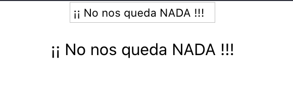

> No he creado ningún componente nuevo. Lo he hecho todo directamente en **App.js**

**App.js**

```jsx
class App extends React.Component {
  constructor(props) {
    super(props);
    this.handleInput = this.handleInput.bind(this);

    // Crear estado inicial (vacío)
    this.state = {
      content: ''
    };
  }

  // Función que cambia valor del <p> según lo que escribamos en input
  handleInput(ev) {
    const inputValue = ev.target.value;
    this.setState({
      content: inputValue
    })
  }

  render() {
    return (
      <div className="App">
        <input type="text" onChange={this.handleInput}></input>
        <p>{this.state.content}</p>
      </div>
    );
  }
}
```

