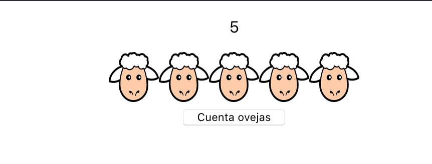

**App.js**

```jsx
function App() {
  return (
    <div className="App">
      <SheepCounter />
    </div>
  );
}
```


**SheepCounter.js**

```jsx
class SheepCounter extends React.Component {
  constructor(props) {
    super(props);
    // estado inicial, contador a 0
    this.state = {
      counter: 0
    }
    this.increaseCounter = this.increaseCounter.bind(this);
  }

  increaseCounter() {
    // actualizar contador (necesitamos función callback porque nos basamos en el estado anterior)
    this.setState((prevState) => {
      const newCounter = prevState.counter++;
      return {
        counter: newCounter
      }
    })

    // Create new image and append it to the sheepcontainer
    const newImg = document.createElement('img');
    newImg.setAttribute('src', 'http://www.clker.com/cliparts/e/4/8/7/13280460782141411990Cartoon Sheep.svg.hi.png');
    const container = document.querySelector('.sheepContainer');
    container.appendChild(newImg);
  }

  render() {
    return(
      <div>
        <div className="sheepContainer">
          <p>{this.state.counter}</p>
        </div>
        <button onClick={this.increaseCounter}>Cuenta ovejas</button>
      </div>
    )
  }
}
```

