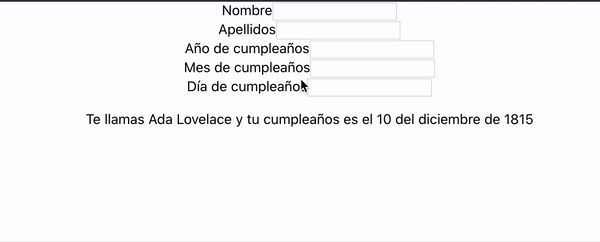

**App.js**

```jsx
class App extends React.Component {
  constructor(props) {
    super(props);
    this.state = {
      firstName: 'Ada',
      lastName: 'Lovelace',
      birthDate: {
        day: 10,
        month: 'diciembre',
        year: 1815
      }
    }

    this.updateData = this.updateData.bind(this);
  }

  updateData() {
    const day = document.getElementById('birthDay').value;
    const month = document.getElementById('birthMonth').value;
    const year = document.getElementById('birthYear').value;

    const newName = document.getElementById('firstName').value;
    const newLastName = document.getElementById('lastName').value;
    this.setState((prevState) => {
      return {
        firstName:newName,
        lastName: newLastName,
        birthDate: {
          ...prevState.birthDate,
          day: day,
          month: month,
          year: year,
        }
      }
    });
  }

  render() {
    return (
      <div className="App">
        <form >
          <label htmlFor="firstName"> Nombre
            <input id="firstName" type="text" onChange={this.updateData}></input>
          </label>
          <label htmlFor="lastName"> Apellidos
            <input id="lastName" type="text" onChange={this.updateData}></input>
          </label>
          <label htmlFor="birthYear"> Año de cumpleaños
            <input id="birthYear" type="text" onChange={this.updateData}></input>
          </label>
          <label htmlFor="birthMonth"> Mes de cumpleaños
            <input id="birthMonth" type="text" onChange={this.updateData}></input>
          </label>
          <label htmlFor="birthDay">  Día de cumpleaños
            <input id="birthDay" type="text" onChange={this.updateData}></input>
          </label>
        </form>
        {/*Párrafo para comprobar que se está actualizando el estado: */}
        <p>Te llamas {this.state.firstName} {this.state.lastName} y tu cumpleaños es el {this.state.birthDate.day} del {this.state.birthDate.month} de {this.state.birthDate.year}</p>
      </div>
    );
  }
}
```

> Creo que este ejercicio se podía resolver de muchas maneras. Tampoco hace falta meterle los `label` pero estaba inspirada.
>
> Le he metido un párrafo extra para asegurarnos que funciona el cambiar el estado.



> Tihihihi <3