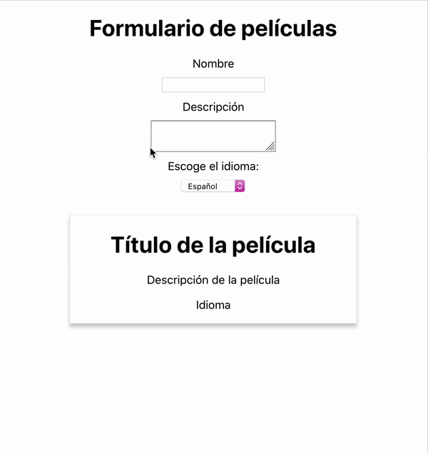

# README


¡Hola! He complicado un poco el asunto al crear dos componentes: **Card.js** y **Form.js** los cuales son hermanos. Ambos están dentro de **App.j**.

👉🏻 El flujo de datos de este ejercicio va de FORM a APP y APP distribuye los datos a CARD para que se visualicen en la tarjeta. Si tenéis alguna duda, escribidme. 

> **UPS** Me he equivocado y le he puesto "user" en vez de "movie". 

**App.js**

```jsx
class App extends React.Component {
  constructor(props) {
    super(props);
    this.state = {
      user: {}
    }
    this.handleFormInfo = this.handleFormInfo.bind(this);
  }

  handleFormInfo(data) {
    this.setState({
      user: data
    })
  }

  render() {
    return (
      <div className="App">
        <h1>Formulario de películas</h1>
        <Form handleFormInfo={this.handleFormInfo}/>
        <Card updatedUser={this.state.user}/>
      </div>
    );
  }
}

export default App;
```

> App.js es un contenedor que maneja estados. Tiene un user que vamos a rellenar con los datos (data) obtenidos del Formulario gracias a la función `handleFormInfo(data)`. Le pasamos esta función al Form para poder llamarla allí, pasándole los datos de la película

**Form.js**

```jsx
class Form extends React.Component {
  constructor(props) {
    super(props);
    // Creamos estado con propiedades de la película
    this.state = {
      name: '',
      description: '',
      language: ''
    }
    this.handleChange = this.handleChange.bind(this);
    this.sendDataToApp = this.sendDataToApp.bind(this);
  }

  // función que recoge datos de los inputs y los mete en el estado
  handleChange(ev) {
    const target = ev.target;
    const value = target.value;
    const id = target.id

    // el id según escribamos en el input de nombre, descripción o languages será diferente (name, description, language), por lo que esta es una manera bonita y sencilla de asignar automáticamente los valores de cada input a su propiedad
    this.setState({
      [id]: value
    }, () => {
      // creo función callback para asegurarme que cuando mando los datos a APP, los datos están actualizados, es decir, se pasan justo después de actualizar el estado con setState (si lo pusiera fuera debajo de setState, se me podrian mandar datos desactualizados)
      this.sendDataToApp(this.state);
    })
  }

  sendDataToApp(data) {
    this.props.handleFormInfo(data);
  }


  render() {

    return(
      <form>
        <label>
          Nombre
          <input 
            type="text" 
            id="name" 
            value={this.state.name}
            onChange={this.handleChange}/>
        </label>

        <label>
          Descripción
          <textarea 
            value={this.state.description}
            id="description"
            onChange={this.handleChange}/>
        </label>

        <label>
          Escoge el idioma:
          <select 
            value={this.state.language}
            id="language"
            onChange={this.handleChange}>
            <option value="Español" defaultChecked>Español</option>
            <option value="Inglés">Inglés</option>
            <option value="Portugués">Portugués</option>
          </select>
        </label>
      </form>);
  }
}
```

**Card.js**

```jsx
const Card = (props) => {
  return (
    <div className="card">
      <h1>{props.updatedUser.name || 'Título de la película'}</h1>
      <p>{props.updatedUser.description || 'Descripción de la película'}</p>
      <p>{props.updatedUser.language || 'Idioma'}</p>
    </div>
  )
}
```

