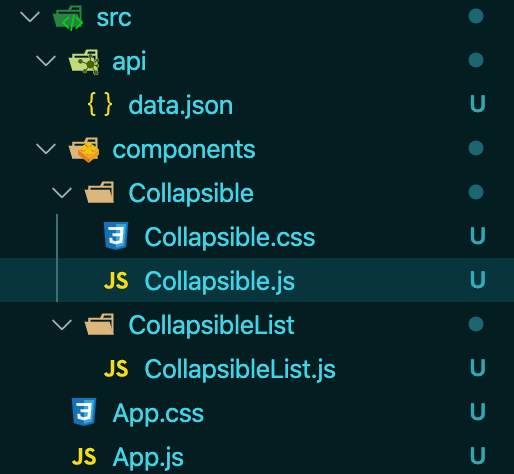

# README


> Componentes de clase

## Estructura



He creado dos carpetas que contienen dos componentes. El collapsable y una lista que recorre los datos dados para pintar tantos colapsables como sean necesarios. 

### Código

**App.js**

```jsx
function App() {
  return (
    <div className="App">
      <CollapsibleList />
    </div>
  );
}
```

**Collapsible.js**

*Versión con comentarios*

```jsx
class Collapsible extends React.Component {
  constructor(props) {
    super(props);
    // estado que nos dice si el colapsable está abierto (true) o cerrado (false)
    this.state = {
      isCollapsibleOpen: false
    }
    this.handleCollapsibleClick = this.handleCollapsibleClick.bind(this);
  }

  // función que maneja lo que ocurre cuando hacemos click en el componente colapsable
  // cda vez que pulsemos el colapsable, el estado isCollapsible Open se inverte (para que
  // el colapsable se cierre si estaba abierto y viceversa)

  // Nota: lo he puesto directamente negando el valor original del estado pero normalmente la mejor
  // práctica es que cuando actualizamos un estado en base al estado original (en este caso el valor contrario
  // del valor original, tenemos que utilizar una función callback. Como esta aplicación es muy sencilla pues
  // no da problemas)
  handleCollapsibleClick = (ev) => {
    // actualizar estado a colapsable abierto
    this.setState({ isCollapsibleOpen: !this.state.isCollapsibleOpen})

  }

  render() {
    return (
      <li className="collapsible-box"
        onClick={this.handleCollapsibleClick}>
        <div className="collapsible">
          <h2>{this.props.name}</h2>
          <span><i className="fas fa-arrow-circle-down"></i></span>
        </div>

        {/* Resolución por operador ternario, si isCollapsibleOpen es true, entonces muetra el texto ese,
                    si no, pues nada (null). Esto se puede hacer tb con condicionales, etc. */}
        {this.state.isCollapsibleOpen ? 
          <div className="content">
            <p>{this.props.source}</p>
          </div> : null}

      </li>
    );
  }
}
```

*Versión sin comentarios*:

```jsx
class Collapsible extends React.Component {
  constructor(props) {
    super(props);

    this.state = {
      isCollapsibleOpen: false
    }
    this.handleCollapsibleClick = this.handleCollapsibleClick.bind(this);
  }

  handleCollapsibleClick = (ev) => {
    this.setState({ isCollapsibleOpen: !this.state.isCollapsibleOpen})

  }

  render() {
    return (
      <li className="collapsible-box"
        onClick={this.handleCollapsibleClick}>
        <div className="collapsible">
          <h2>{this.props.name}</h2>
          <span><i className="fas fa-arrow-circle-down"></i></span>
        </div>


        {this.state.isCollapsibleOpen ? 
          <div className="content">
            <p>{this.props.source}</p>
          </div> : null}

      </li>
    );
  }
}
```

**CollapsibleList.js**

```jsx
class CollapsibleList extends React.Component {
  constructor(props) {
    super(props);
    this.state = {
      palettes: data
    }
  }

  render() {
    const  collapsibleItems = this.state.palettes.map(el => {
      return (
        <Collapsible 
          key={el.name}
          name={el.name}
          source={el.from} />
      );
    })

    return (
      <ul>
        {collapsibleItems}
      </ul>)
  }
}
```

