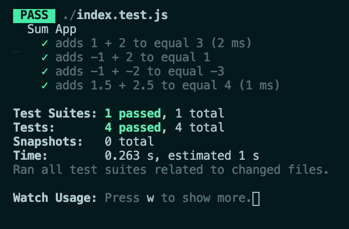

# README


**index.test.s**

```js
const sum = require('./index');

// test suite for the sum function
describe('Sum App', () => {

  // test suma de números positivos
  test('adds 1 + 2 to equal 3', () => {
    expect(sum(1, 2)).toBe(3);
  });

  // test de números positivos y negativos
  test('adds -1 + 2 to equal 1', () => {
    expect(sum(-1, 2)).toBe(1);
  });

  // test de números negativos
  test('adds -1 + -2 to equal -3', () => {
    expect(sum(-1, -2)).toBe(-3);
  });

  // test de números decimales
  test('adds 1.5 + 2.5 to equal 4', () => {
    expect(sum(1.5, 2.5)).toBe(4);
  });
})
```

**Resultado en terminal:**



