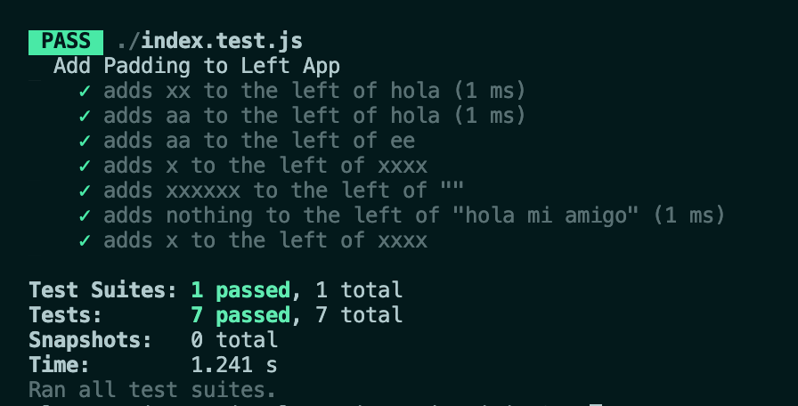

# README


**index.js**

```js
function paddingLeft(string, flength, paddingValue) {
  while (string.length < flength) {
    string = paddingValue + string;
  }
  return string;
}
module.exports = paddingLeft;
```

**index.test.js**

```js
const paddingLeft = require('./index');

// test suite for paddingLeft function
describe('Add Padding to Left App', () => {

  test('adds xx to the left of hola', () => {
    expect(paddingLeft('hola', 6, 'x')).toBe('xxhola');
  })

  test('adds aa to the left of hola', () => {
    expect(paddingLeft('hola', 6, 'a')).toBe('aahola');
  })

  test('adds aa to the left of ee', () => {
    expect(paddingLeft('ee', 4, 'aa')).toBe('aaee');
  })

  test('adds x to the left of xxxx', () => {
    expect(paddingLeft('xxxx', 6, 'x')).toBe('xxxxxx');
  })

  test('adds xxxxxx to the left of ""', () => {
    expect(paddingLeft('', 6, 'x')).toBe('xxxxxx');
  })

  test('adds nothing to the left of "hola mi amigo"', () => {
    expect(paddingLeft('hola mi amigo', 6, 'x')).toBe('hola mi amigo');
  })

  test('adds x to the left of xxxx', () => {
    expect(paddingLeft('xxxx', 0, 'x')).toBe('xxxx');
  })
});
```

**Result:**

