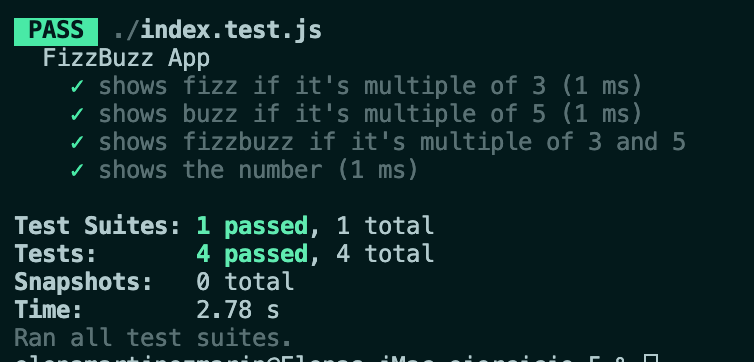

# README


**Step 1: Tests**

```js
const fizzBuzz = require('./index');

// test suite for paddingLeft function
describe('FizzBuzz App', () => {

  test('shows fizz if it\'s multiple of 3', () => {
    expect(fizzBuzz(9)).toBe('fizz');
  })

  test('shows buzz if it\'s multiple of 5', () => {
    expect(fizzBuzz(10)).toBe('buzz');
  })

  test('shows fizzbuzz if it\'s multiple of 3 and 5', () => {
    expect(fizzBuzz(15)).toBe('fizzbuzz');
  })

  test('shows the number', () => {
    expect(fizzBuzz(11)).toBe(11);
  })


});

```

**Step 2: code**

```js
function fizzBuzz(number) {
  if (number % 5 === 0) {
    if ( number % 3 === 0) {
      return "fizzbuzz";
    }
    return "buzz";
  } else if (number % 3 === 0) {
    return 'fizz';
  } else {
    return number;
  }
}
  module.exports = fizzBuzz;
```

**Result:**



