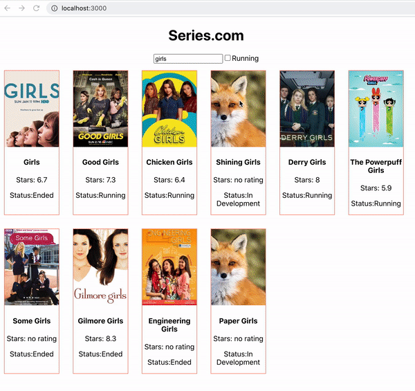

# README

Para entender mi ejercicio repasar:

- ciclos de vida de componentes (especialmente en lo referente a los componentes funcionales)

---

Los estilos son patata cocida. Siento no poder dejar mejores comentarios o indicaciones pero he hehco el ejercicio corriendo corriendo y ahora tengo sueño. 

