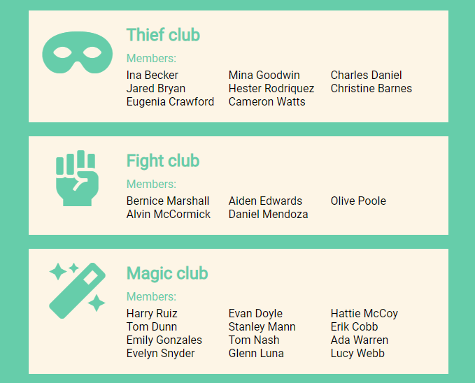

# README

## Modulo 3. Repaso intermedio.

Resuelto con componentes de clase.

**App.js**
```jsx
const clubs = [
  {
    "name": "Book club",
    "fa": "fas fa-glasses",
    "members": [
      "Rosalie Bradley",
      "Lula Day",
      ......
      }]

function App() {
  return (
    //Llamamos al componente ClubList que está compuesto por la guia de clubs que nos dan en la informacion del ejercicio
    <div className='App'>
      <ClubList clubActivity={clubs} />
    </div>
  );
}

export default App;
```

**ClubList.js**
```jsx
class ClubList extends React.Component {
  render() {
    // Llamamos a las props del array de clubs
    // En este caso estamos llamando a cada CLUB compuesto por icono, nombre y miembros
    const clubs = this.props.clubActivity;
    // Llamamos al metodo map para que nos devuelva el mismo array con los datos del componente/plantilla Club
    const newClubs = clubs.map((element) => {
      return (
        <Club name={element.name} icon={element.fa} members={element.members} />
      );
    });
    // Nos devuelve el nuevo array de clubs
    return <div>{newClubs}</div>;
  }
}
```

**Club.js**
```jsx
class Club extends React.Component {
  render() {
    // Llamamos a las props del array de clubs
    // En este caso estamos llamando a los MIEMBROS de cada actividad
    const members = this.props.members;
    // Llamamos al metodo map para que nos devuelva el mismo array de miembros pero cada uno metido en un elemento de la lista
    const newMembers = members.map((element) => {
      return <li>{element}</li>;
    });
    return (
      <div className='activity'>
        {/* Llamamos a cada icono de la guia de clubs */}
        <div className={this.props.icon}></div>{' '}
        <div className='activity__info'>
          {/* Llamamos a cada titulo/nombre de la guia de clubs */}
          <h2 className='activity__info__title'>{this.props.name}</h2>{' '}
          {/* Llamamos a la lista de miembros de cada club */}
          <p className='activity__info__titleList'>Members:</p>
          <ul className='activity__info__List'>{newMembers}</ul>{' '}
        </div>
      </div>
    );
  }
}
```

**Resultado** Actualizando los estilos:

