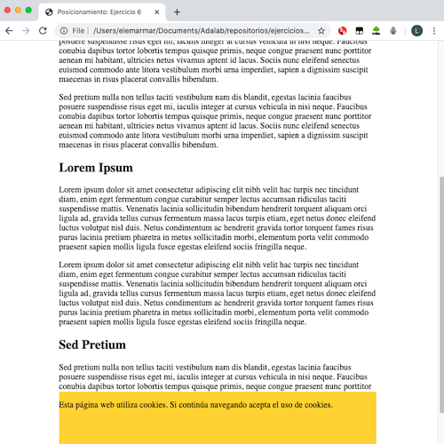

# Aviso de cookies

### 

Todas las cajas aparecen centradas en el medio de la ventana del navegador. Su posición es absoluta, con lo que están posicionadas relativas a la ventana del navegador. 

---

### 

**Nota** "cosas extra que he hecho":

- Le he puesto al `body` un ancho máximo de `600px` para que cuando agrandemos la ventana, el contenido se visualice mejor y no salgan párrafos larguísimos. 
- Le he asignado al `body` un `margin: auto` lo que hace que los márgenes horizontales se calculen automáticamente y se centre el cuerpo de la página.
- Le he dado al div que contiene el aviso de cookies un ancho de `600px` para que ocupe lo mismo que el body.
