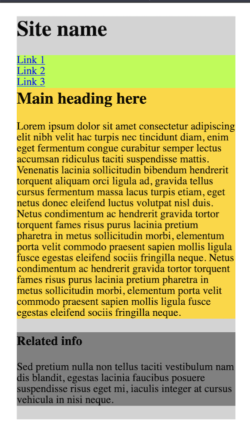
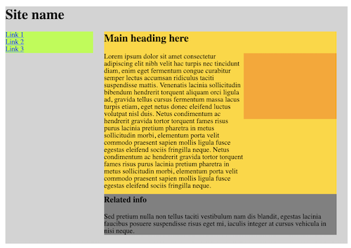
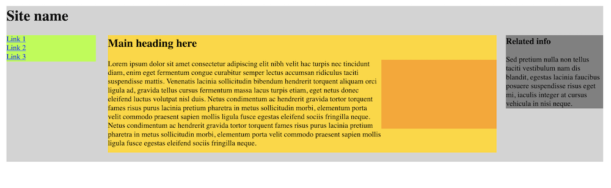

# 

# Media Query

> ⚠️ **Nota**:
>
> En mi documento he utilizado medidas `rem` en vez de `px` para que en cada media query pudiera disminuir el tamaño general de todo (*fuentes, padding...*) según el tamaño de la pantalla con sólo cambiar el `font-size` de `<html>`.

---

### Opción 1: Flexbox

Para la primera opción partimos de la siguiente estructura:

```html
<div class="container">
  <h1>Título</h1>
  <nav></nav>
  <main>
  	<article>
    	<h2>Artículo</h2>
      <p></p>
      <div class="orange"></div>
    </article>
    <aside></aside>
  </main>
</div>
```

Vamos a resolver el problema utilizando sólo **flexbox**. Para ello convertiremos en contenedores flex los siguientes elementos:

- `<div class="container">`  - **flex container**
  - h1 - f*lex item*
  - nav - f*lex item*
  - main - f*lex item* y **flex container**
    - h2 - *flex item*
    - p - *flex item*
    - .orange - *flex item*
- `<main>` - **flex container**
  - article - f*lex item*
  - aside - f*lex item*

#### Mobile version



Para la versión mobile de base no he definido ningún contenedor flex todavía, por lo que todo el contenido aparece de arriba a abajo.  

> 👉🏻 Se podría activar el contenedor en nuestra versión base mobile y ponerlo en modo columna para obtener el mismo resultado.
>
> ```css
> .container {
>   display: flex;
>   flex-direction: column;
> }
> ```

#### Tablet version



Para la versión tablet he activado los contenedores flex.

```css
.container {
    display: flex;
    flex-wrap: wrap;
    align-items: flex-start;
}

article {
    display: flex;
    flex-wrap: wrap;
    padding-bottom: 1rem;
}
```

Además, he asignado las siguientes `width`:

Estructura general:

- `h1` y `h2`: `100%` para que ocupen toda la fila y empujen a los siguientes elementos a la segunda fila.
- `nav`: `30%` aunque le he puesto un `max-width: 20rem` para que no sea demasiado larga según agrandamos la ventana.
- `main`: `68%` puesto que comparte file con `nav`, entre los dos suman `98%` con lo que el 2% de espacio sobrante en la fila se reparte en espacios.  ⚠️ Para que el espacio se reparta entre `main  `de manera equitativa, he utilizado `marin: auto;` 

Sección de artículo:

- `h1` tiene width de 100% para ocupar toda la fila
- `p` tiene width de 60% y crece 3 veces más rápido que el cuadrado naranja (`flex-grow: 3`)
- `.orange` lo defino por primera vez, dándole un height, con lo que aparece (antes no aparecía porque en versión móvil no tenía height). Le doy un 40%

#### Desktop version



Para esta última versión activo el flex conainer de `<main>` para así separar el `<article>` y el `<aside>` y reviso la anchura de todos los elementos.

```css
main {
  width: 83%;
  display: flex;
  justify-content: space-between;
  align-items: flex-start;
  margin: 0;
  margin-left: 2%;
}
```

---

### Otras opciones:

1. Se podrían utilizar **floats**, especialmente util creo para el cuadrado naranja dentro del article. 
2. Se podría prescindir de `<main>` de manera que las tres cajas principales (nav, article, aside) sean hermanas y sea más fácil colocarlas (además permite que los márgenes en la versión desktop sean iguales). Problema: En la versión tablet habría que utilizar quizá un posicionamiento absoluto para el `<aside>` para pegarlo justo debajo del `<article>` si no, ocuparía toda la fila.

---

Si se te ocurre otra idea, ¡comparte!