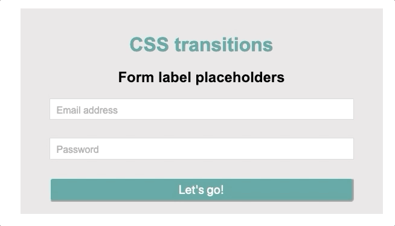
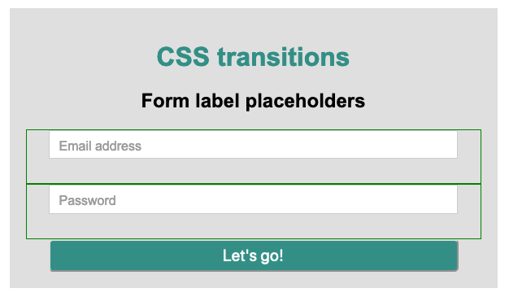

# Animando el label de un formulario



En este ejercicio tenemos que animar un label para que primero aparezca dentro del input y hacer focus en el input se desplace arriba según el gif. 

Para hacer esto he decidido posicionar el `label` **absolute**. Como tanto el label como el input los he colocado dentro de un `<div class="form-item">` con `position: relative` he podido cambiar la posición del label con respecto del `form-item` facilmente.



La caja con borde verde es el `form-item` al coincidir la parte superior con la parte superior del input ha sido fácil colocarlo:

```html
<!-- Email -->
<div class="form-item">
	<input type="email" id="email" name="email">
	<label for="email">Email address</label>
</div>
```

```css
.form-item {
	position: relative;
}

label {
/* Posicionarlo dentro del input */
	position: absolute;
	left: 40px;
	top: 10px;
	color: rgb(156, 156, 156);

/* Animación del label */
	transition: all 0.5s ease;
}
```

> ⚠️ He colocado el **label** después del **input** en el html porque esto me permite alterar el label utilizando la pseudoclase  `:focus` sobre `input`:
>
> ```css
> input:focus ~ label {
> /* posicionamiento encima del input (con respecto al form-item) */
> 	top: -20px;
> 	left: 30px;
> 
> /* Otros cambios */
> 	font-size: 13px;
> 	color: black;
> }
> ```
>
> Esto se traduce en "cuando haga focus en input" el label hermano de input (`~` -> next sibling) adquiere los siguientes estilos"
>
> 👉🏻 Si no hubiera puesto el label después del input en el html `input:focus ~ label` no habría funcionado pues `~` toma al **siguiente** hermano.

