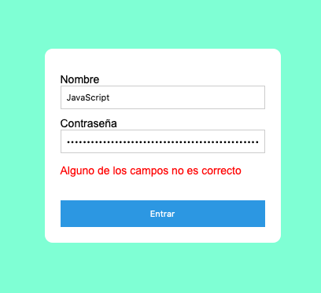
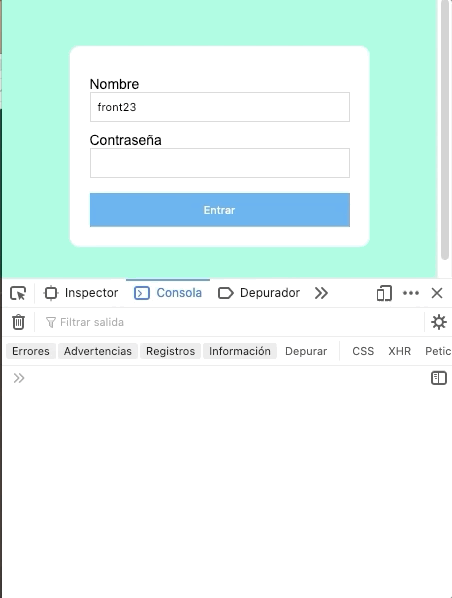

# Ejercicio de fin de semana javascript



Aquí expongo mi solución al ejercicio. Como siempre, ¡hay infinitas maneras de resolverlo! 🎉🕺🏻💃🏼

---

## Paso 1: Crear constantes que hagan referencia a elementos del HTML

Vamos a necesitar utilizar constantes que hagan referencia al input donde se pone el nombre (**username**), al input donde se pone la contraseña (**password**), al botón de entrar (**button**) y al mensaje oculto (**errorMsg**).

```js
const username = document.querySelector('.js-user-name');
const password = document.querySelector('.js-user-password');
const button = document.querySelector('.js-login-button');
const errorMsg = document.querySelector('.error-wrapper');
```

---

## Paso 2: Lo que viene por defecto

Echamos un ojo a lo que nos viene dado en el ejercicio:

```js
//Number of user attemps
let attemps = 0;

//Object saved in BBDD with user information to compare with my form
const userInfo = {
	name: 'front23',
	password: 'bicicleta'
};
```

- **attemps** es una variable (👉🏻esto quiere decir que puede cambiar de valor) que indica el número de intentos. Es decir, el número de veces que le hemos dado click al botón de entrar. 
  👉🏻 Queremos que el valor de `attemps` aumente por uno cada vez que pinchemos en el botón.

- **userInfo** es un objeto que tiene dos propiedades: `name` y `password`. 👉🏻 Queremos comparar lo que metamos en los inputs de `username` y `password` con estas propiedades del objeto **userInfo**.

  > ℹ️ Para esto no olvides que habrá que especificar la propiedad en cada caso con:
  >
  > - `userInfo.name` para contrastar con el nombre
  > - `userInfo.password` para contrastar con la contraseña

---

## Paso 3: Creando la función 👩🏻‍💻

Voy a crear una función que se llamará **checkInfo** y que hará lo siguiente:

1. Comprobar si los valores que hemos introducido en `username` y `password` coinciden con los valores de las propiedades del objeto **userInfo** (`userInfo.name` y `userInfo.password`)
   - **SI** --> mostrar mensaje de que estás dentro
   - **NO** --> pasar al paso 2
2. Comprobar si el número de intentos es superior a 3
   - **SI** --> BLOQUEADO 🔥
   - **NO** --> pasar al paso 3
3. Quitar la clase de `hidden` al **errorMsg**

```js
function checkInfo() {
  attemps++;
  
  // ¿Username y password coinciden con los valores del objeto?
  if (username.value === userInfo.name && password.value === userInfo.password) {
  alert("Estás dentro 🕺🏻")

  // Si no coinciden y este es el cuarto intento (attemps > 3) -> BLOQUEADO 😈
  } else if (attemps > 3) {
    alert('Estás bloqueado 🙅)
    
  } else {
    errorMsg.classList.remove('hidden');
    }
}
```

> ⚠️ **ANOTACIÓN**: **EL DILEMA** 🤔
>
> Ten en cuenta que de esta manera el usuario **tiene 4 intentos de poner bien la contraseña**,
>
> 👉🏻 Una interpretación diferente del enunciado sería que cuando intentemos 3 veces, si no hemos acertado, que nos aparezca bloqueado. En ese caso el condicional sería `if (attemps > 2)` de modo que si la tercera vez que lo intentamos fallamos, nos bloquea, sin dejarnos intentarlo una cuarta vez. Creo que esta es más acertada pero dejé la anterior por dejar el `attemps > 3`, que quizá sea más sencillo de comprender.
>
> ℹ️ Se puede jugar colocando el condicional de bloqueo en otra posición o incluso el propio `attemps++`
>
> Claro que el enunciado dice "Si el usuario supera los 3 intentos aparecerá un mensaje de alert que diga estás bloqueado." por lo que yo podría interpretar que si hago más intentos de 3, es cuando me sale el mensaje, con lo cual sería al cuarto. Cuestión de gustos 🧠

---

## Paso 4: Event listener y a disfrutar del finde 🎉

Por último añadimos el event listener al botón, lo cuál no tiene mucha complicación:

```js
button.addEventListener('click', checkInfo);
```

---

## Paso extra: 🤯

Le puedes añadir un console.log en el último condicional que no es de bloqueo ni de comparación de valores para que, cada vez que falles, te aparezca un mensaje en la consola que te indique por qué intento vas: ( 👉🏻también se lo puedes meter debajo del `attempts++` en cuyo caso nos diría en attempt nada más clickear el botón)

```js
/.../
  } else {
    errorMsg.classList.remove('hidden');
    console.log("attempt: " + attemps);
  }
}
```

⚠️ A continuación se pueden ver los attemps y cómo realmente disponemos de 4 intentos pues en el segundo gif, el usuario logra entrar al cuarto intento. Hay muchas maneras de corregir esto, una de ellas cambiando el `attemps > 3` por `attemps > 2`. 


DEATH 💀



SUCCESS 🎉

