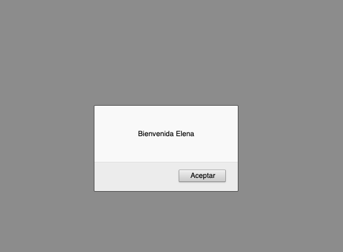

# Control de acceso

> **Nota**: utilizo `alert()` para mostrar el mensaje de bienvenida en la pantalla.

Partimos de una constante que creamos a la que le asignamos un nombre --el que queramos. Aquí he escogido el nombre de mi pareja:

```js
'use strict';

// variable con nombre
const name = 'Lucía';
```

A continuación queremos utilizar un condicional para que nos muestre un mensaje de bienvenida si el nombre es el nuestro o el de nuestra pareja. En caso contrario, nos debe mostrar otro mensaje:

La estructura básica sería así:

```js
if ( ...) {
    alert("Bienvenida " + name);
    } else {
      alert("Lo siento pero el usuario que has introducido no está registrado");
    }
```

La condición a evaluar dentro del `if` debe de tener un operador `OR` (`||`) ya que queremos que salga el mensaje tanto si el nombre es el nuestro como el de nuestra pareja:

```js
if (name === 'Elena' || name === 'Lucía');
```

> *"Si `name` tiene el valor de Elena mostrar el mensaje de bienvenida SI NO lo tiene, PERO tiene el valor de Lucía mostrar el mensaje de bienvenida"*

Resultado:

Para `name = 'Elena'` y `'name = 'Lucía'`:




Con `name = 'Begoña'`: 


