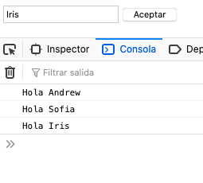

> **Nota**
>
> La constante que hace referencia al input la creo dentro de la función anónima llamada por el eventListener del botón. 
>
> ```js
> button.addEventListener('click', function () {
>     const name = document.querySelector('#myInput').value;
>     console.log(`Hola ${name}`);
> })
> ```
>
> De esta manera, recogemos el valor del input UNA VEZ lo hemos introducido y pulsado el botón aceptar. Si la definiéramos antes tal que así:
>
> ```js
>  const name = document.querySelector('#myInput').value;
> button.addEventListener('click', function () {
>     console.log(`Hola ${name}`);
> })
> ```
>
> Ten en cuenta que el input tiene un value por defecto, por lo que al cargar la página, recogería el valor por defecto de antes que le asignemos uno escribiendo en el input. 

Resultado:

